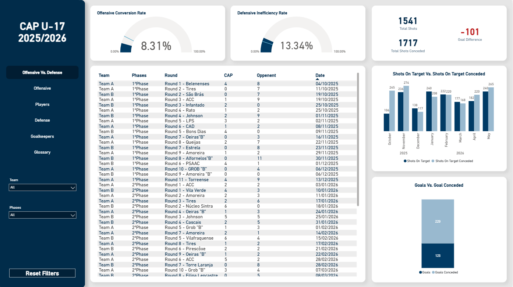
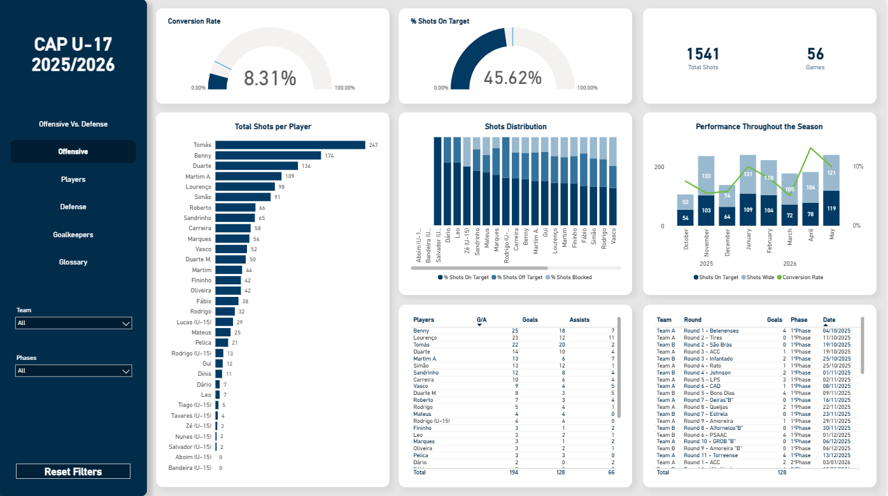
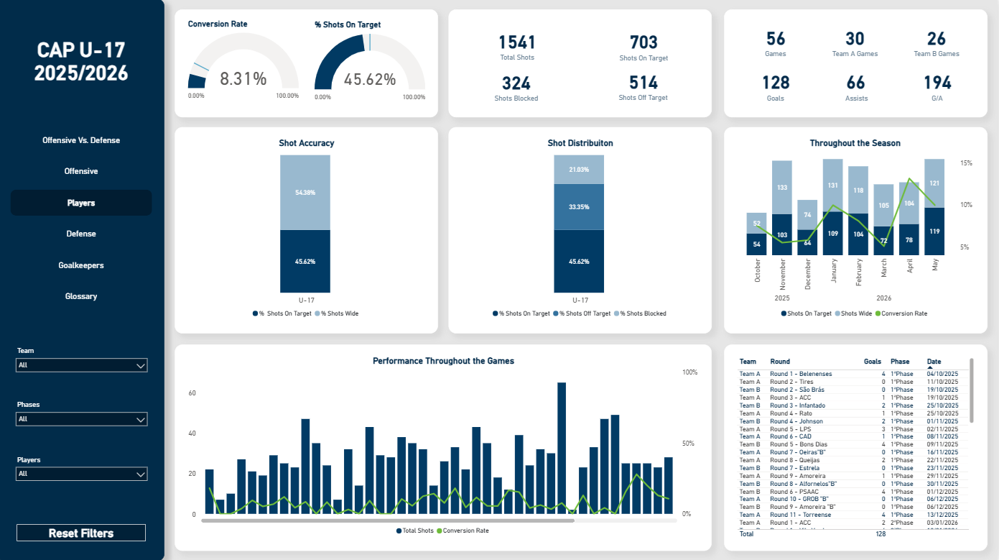
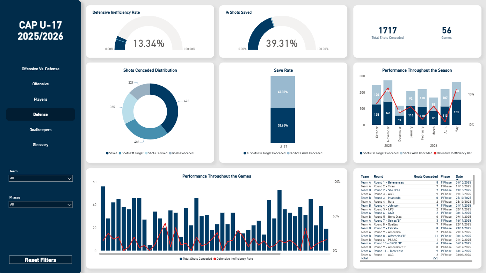
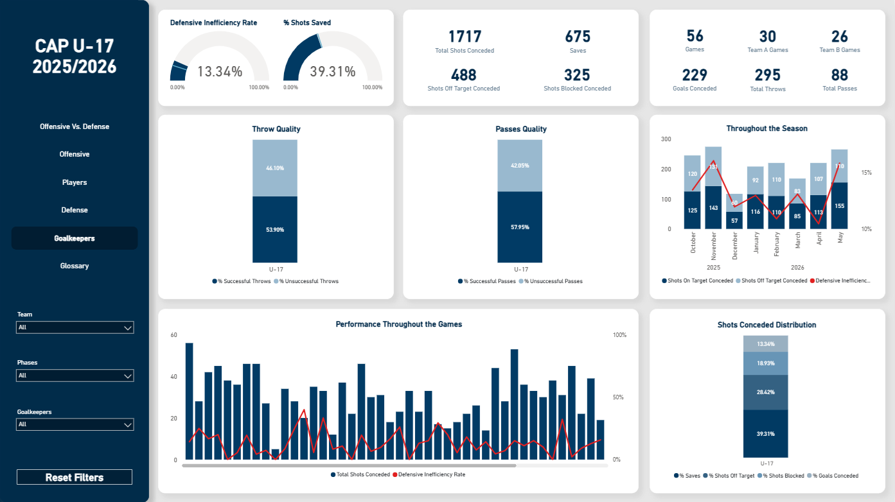
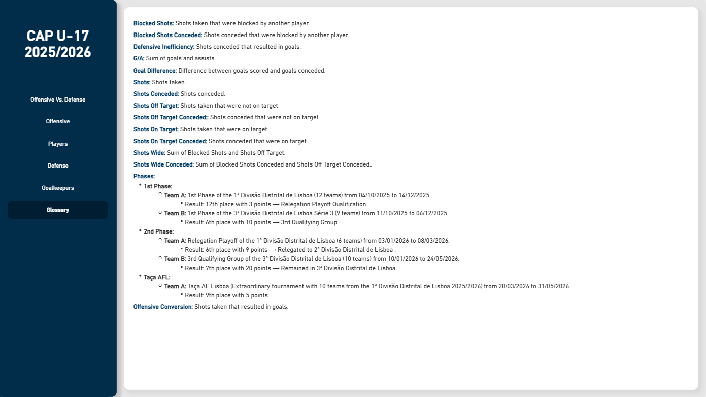

# CAP U-17 Futsal Analytics — 2025/2026 Season
 
An end-to-end analytics project built entirely from self-collected match data. Unlike my other portfolio projects, which use public datasets, this one, I started from scratch: I tracked offensive and defensive statistics for every player and goalkeeper across all 56 games of the 2025/2026 season while working as an analyst for an U-17 club, a Futsal club with a Team A and B, recording each match manually in Excel before modelling and visualizing it in Power BI. The result is a multi-page report covering a combined attack-vs-defense view, offensive, player, defensive and goalkeeper performance. With this analysis, I was able to give the coaching staff a full picture of team and player performance across the season.
 

 
## Data Collection & Structure
 
The dataset was built entirely from scratch in Excel. I created two files, one for the offensive stats and the other for the defensive stats. These tables were updated every week, as they were based on match observation across the full 2025/2026 season. It's organized into two source tables, connected through a third table built in Power Query:
 
- **Offensive stats** (per player, per game): ID Game, Round, Date, Team, Players, Shots On Target, Shots Blocked, Shots Off Target, Goals, Assists, Phases
- **Defensive stats** (per goalkeeper, per game): ID Game, Round, Date, Team, Goalkeepers, Saves, Shots Off Target Conceded, Shots Blocked Conceded, Goals Conceded, Successful Throws, Unsuccessful Throws, Successful Passes, Unsuccessful Passes, Phases
- **TeamMatch** (Power Query, connecting table): ID Game, Round, Date, Team, Phases, U-17
The unified data model was created to enable cross-analysis between offensive and defensive performance, where it was mainly used on the Offensive vs. Defense page.
 
## What the Report Enables

**Offensive Vs. Defense**: A combined, round-by-round view matching each game's offensive output against what was conceded, surfacing patterns like results driven by efficiency rather than shot volume, or losses caused by defensive breakdowns. Filterable by Team and Phase.

 
**Offensive**: Team-level shooting performance: total shots, shot distribution (on target / off target / blocked), conversion rate, and shot accuracy, tracked across the season. Filterable by Team and Phase.

 
**Players**: Individual player breakdowns of the same offensive metrics, plus goals, assists, and G/A, allowing performance comparison and drill-down by player. Filterable by Team, Phase, and Player.

 
**Defense**: Team-level defensive performance: shots conceded, save rate, defensive inefficiency rate, and shots-conceded distribution, tracked across the season. Filterable by Team and Phase.

 
**Goalkeepers**: Individual goalkeeper breakdowns of defensive metrics, plus throw and pass distribution quality, giving a fuller picture of a goalkeeper's contribution beyond shot-stopping alone. Filterable by Team, Phase, and Goalkeeper.

  
**Glossary**: A full reference of every metric and competition phase used across the report, for anyone unfamiliar with the terminology or the club's season structure.

## Key Technical Decisions
 
- **Layered shot categorization**: Shots are broken into On Target, Off Target, and Blocked, with Off Target and Blocked further rolling up into a combined "Shots Wide" total, allowing analysis at both a granular and summarized level without double-counting.
- **Unified data model via ID Game**: The offensive and defensive tables are independent by design, so a connecting table (TeamMatch) was built in Power Query using ID Game as the key, enabling round-by-round comparison without merging the two source tables directly.
- **Goal Difference as a calculated measure**: Rather than a static column, Goal Difference is calculated in DAX (`SUM(Offensive[Goals]) - SUM(Defensive[Goals Conceded])`) so it updates dynamically with whatever filters (team, phase) are applied, pulling from both source tables via the unified model.
- **Reusable measure pattern across shot types**: Conversion Rate (`SUM(Offensive[Goals]) / [Sum Total Shots]`) and Defensive Inefficiency Rate (`SUM(Defensive[Goals Conceded]) / [Total Shots Conceded]`) were built as parallel DAX measures, keeping the offensive and defensive sides of the report directly comparable. This same pattern, a percentage measure per shot type (e.g., `% Shots On Target`), was repeated consistently across every shot category, on both the offensive and defensive side, to keep the model uniform and easy to extend.
## Tools Used
 
- **Excel**: manual data collection and dataset construction (offensive and defensive source files)
- **Power Query**: data transformation and table connections (TeamMatch)
- **Power BI**: report building and visualization
- **DAX**: calculated measures

## Live Dashboard
You can also view the dashboard directly on Power BI: 

## Author
Fábio Tavares | 2026

